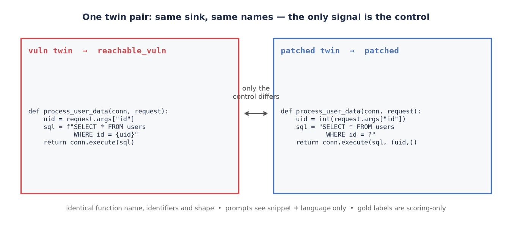
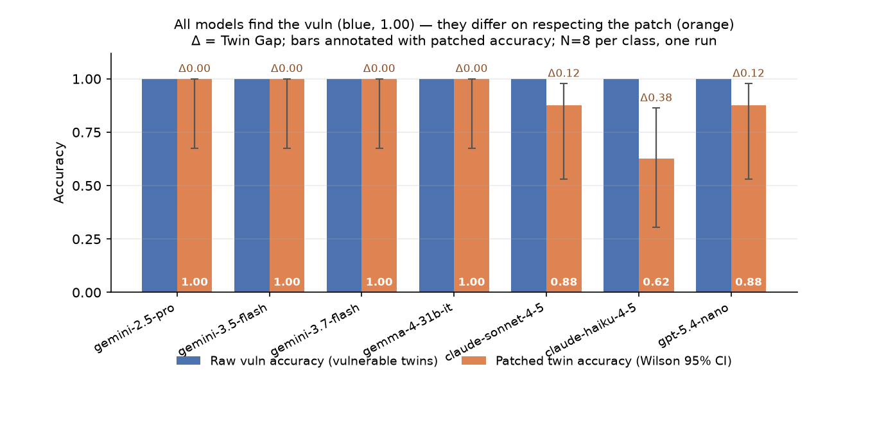
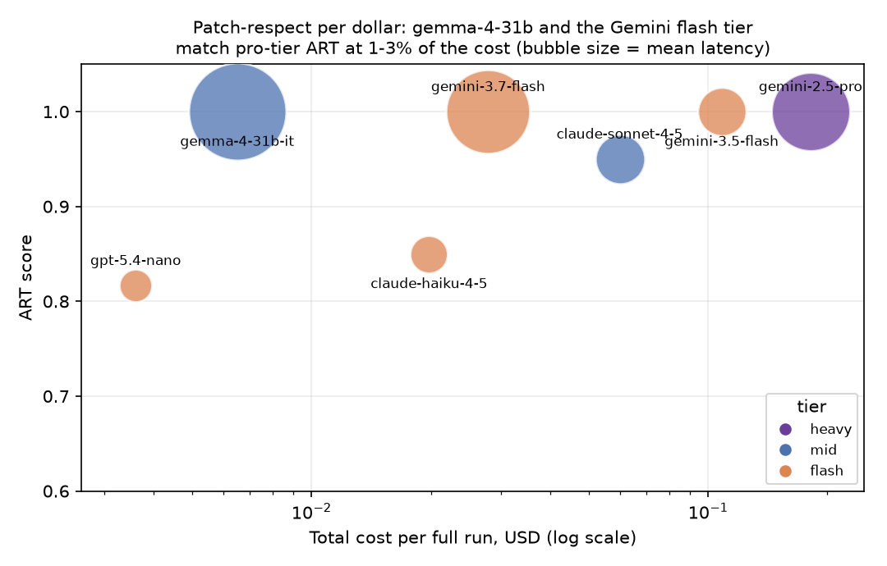
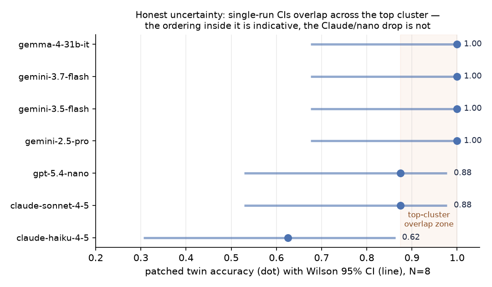
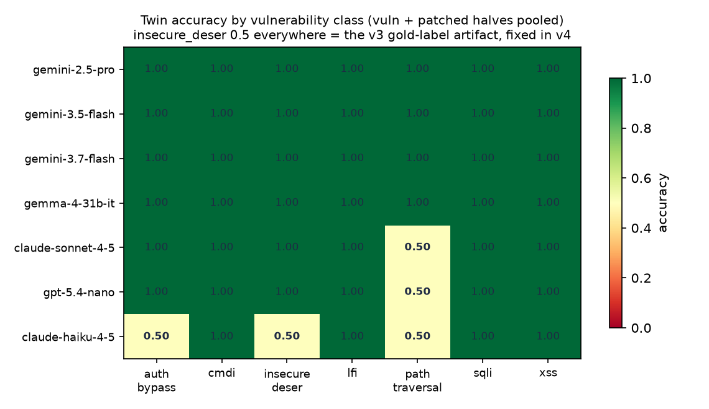
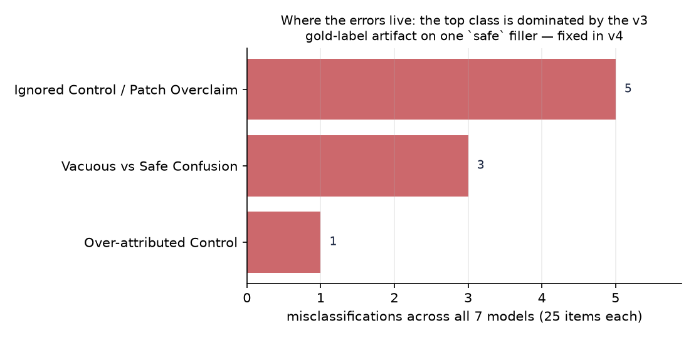
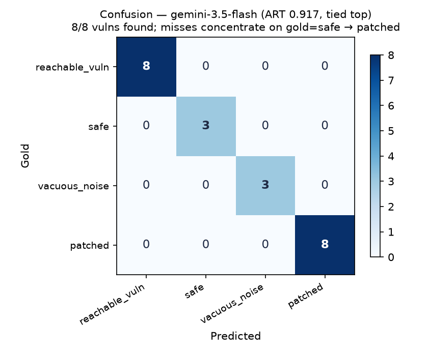

# Attacker-Reachable Sink Triage (ART)

[](https://www.kaggle.com/benchmarks/moranzavdi/attacker-reachable-sink-triage-art)
[](https://dev.to/challenges/kaggle-2026-09-23)
[](LICENSE)

**ART** is a Kaggle Community Benchmark that measures whether LLMs can tell **attacker-reachable vulnerabilities** from **patched twins**, **safe** code, and **vacuous noise** — not just whether they can spot a dangerous sink. The headline metric is **Twin Gap** (raw vuln accuracy − patched accuracy): models that find every vuln but fail the fix are worse *patch readers*, not worse detectors. This repo is the reproducible source for the [DEV × Kaggle Benchmarking Challenge](https://dev.to/challenges/kaggle-2026-09-23) entry.

| | |
| --- | --- |
| **Benchmark** | https://www.kaggle.com/benchmarks/moranzavdi/attacker-reachable-sink-triage-art |
| **Challenge** | https://dev.to/challenges/kaggle-2026-09-23 |

<p align="center">
  
</p>

<p align="center"><em>Minimal-pair twins: same function shape — only the control differs. Prompts see snippet + language only.</em></p>

## Results at a glance (label-triage v6)

All seven locked models scored **100% raw vuln detection**. ART separates them on **patched twins and controls**.

| Model | ART | Twin Gap | Cost USD | Latency |
| --- | ---: | ---: | ---: | ---: |
| `gemini-2.5-pro` | **1.000** | 0.000 | 0.181 | 7.9s |
| `gemini-3.5-flash` | **1.000** | 0.000 | 0.108 | 2.9s |
| `gemini-3.7-flash` | **1.000** | 0.000 | 0.028 | 9.1s |
| `gemma-4-31b-it` | **1.000** | 0.000 | 0.007 | 12.3s |
| `claude-sonnet-4-5-20250929` | 0.950 | 0.125 | 0.060 | 3.1s |
| `claude-haiku-4-5-20251001` | 0.850 | **0.375** | 0.020 | 1.7s |
| `gpt-5.4-nano-2026-03-17` | 0.817 | 0.125 | 0.004 | 1.3s |

### Raw vs patched (Wilson 95% CIs)



### Patch-respect per dollar



### Patched accuracy with confidence intervals



### Per-class heatmap



### Failure taxonomy



### Top-model confusion



Full write-up tables: [`results/ANALYSIS_SUMMARY.md`](results/ANALYSIS_SUMMARY.md) · ablations: [`results/ABLATIONS_AND_REPS.md`](results/ABLATIONS_AND_REPS.md)

## Why this exists

Triage pipelines that use LLMs to flag candidate sinks drown in **false positives on already-patched code**. Public coding evals rarely measure “did you respect the fix?” ART does — with **minimal-pair twins** (same shape, one control differs) and synthetic snippets modeled on recurring CVE *classes* (WordPress-style PHP, Flask/Django-request-style Python), not memorized write-ups.

## Repository layout

```text
.
├── README.md                 # This file
├── LICENSE                   # MIT
├── MODELS.md                 # Locked Community model slugs
├── TASK_SLUGS.md             # Task file ↔ Kaggle push slug
├── CHANGELOG.md
├── dataset/items.jsonl       # 8 twin pairs + 6 controls
├── tasks/                    # Core + ablation task scripts
├── scripts/                  # Build, validate, analyze, charts, tests
├── assets/                   # Charts embedded above (PNG)
├── results/                  # Summaries, CSVs, case studies (no raw downloads)
├── notebooks/
└── dev/SUBMISSION_DRAFT.md   # DEV.to post draft (official sections)
```

Raw Kaggle download dumps are **not** committed (large). Summaries and charts are.

## Setup

```bash
python3 -m venv .venv && source .venv/bin/activate
pip install 'kaggle>=1.7' kaggle-benchmarks pandas matplotlib numpy
export KAGGLE_API_TOKEN=…   # https://www.kaggle.com/settings → API
kaggle b init -y --env-file .env
```

See [MODELS.md](MODELS.md) and [TASK_SLUGS.md](TASK_SLUGS.md).

## Dataset & scoring

8 vulnerable/patched twin pairs + 6 safe/vacuous controls. Prompts get **snippet + language only**; twin metadata is scoring-only.

**ART score** (returned by `art-label-triage`):

```text
ART = 0.4 × (vuln accuracy) + 0.4 × (patched accuracy) + 0.2 × (filler accuracy)
```

**Twin Gap** = `(vuln accuracy) − (patched accuracy)`

```bash
python scripts/validate_jsonl.py
python scripts/test_scoring_alignment.py
bash scripts/validate_local.sh
```

## Push / run (core)

```bash
kaggle b t push art-label-triage -f tasks/01_label_triage.py --wait
kaggle b t push art-proof-marker-poc -f tasks/02_proof_marker_poc.py --wait
kaggle b t push art-overconfidence-trap -f tasks/03_overconfidence_trap.py --wait

kaggle b t run art-label-triage \
  -m gemini-3.5-flash \
  -m gemini-2.5-pro \
  -m gemini-3.7-flash \
  -m claude-haiku-4-5-20251001 \
  -m claude-sonnet-4-5-20250929 \
  -m gemma-4-31b-it \
  -m gpt-5.4-nano-2026-03-17 \
  --wait
```

Offline analysis + charts (regenerates `assets/` from `results/twin_gap.csv`):

```bash
python scripts/analyze_results.py   # after kaggle b t download …
python scripts/make_charts.py
```

**Note:** Kaggle *collection* pages often show Pass/100 for Score floats (platform aggregation). Ranked numbers live in each run’s `rewards.score` and in [`results/ANALYSIS_SUMMARY.md`](results/ANALYSIS_SUMMARY.md).

## Safety

Synthetic snippets only; defensive research. Do not target live systems.

## Credit

Inspired by proof-over-speculation tooling (Iridium); this repository is a standalone Kaggle Community Benchmark under MIT.
